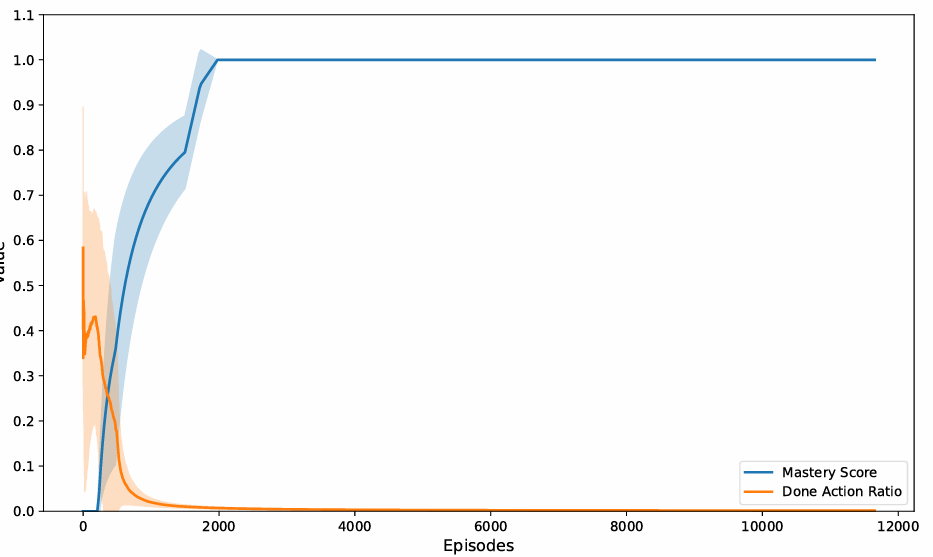

# WVF in Continuous Control: Goal-Conditioned Reinforcement Learning with Continuous WVF and Langevin Sampling

This repository implements a **GCRL Soft Actor-Critic (SAC)** framework enhanced with **World Value Function (WVF)** critics and **Langevin-based goal sampling**.  
It supports **Gymnasium Robotics** environments and custom wrappers that allow the agent to autonomously discover and refine internal goals.

---

## Requirements

### Python
- **Python 3.10 or 3.11**  
  *(Python 3.12 is not yet fully compatible with `mujoco` and `gymnasium-robotics`.)*

### Dependencies
| Package | Purpose | Recommended Version |
|----------|----------|----------------------|
| `torch` | Deep learning and policy/value networks | ≥ 2.0.0 |
| `gymnasium` | Reinforcement learning environments | ≥ 0.29.1 |
| `gymnasium-robotics` | Robotic and goal-conditioned tasks | ≥ 1.3.0 |
| `mujoco` | Physics simulator backend for robotics | ≥ 3.0.0 |
| `numpy` | Numerical operations | ≥ 1.24 |
| `tensorboard` | Logging and visualization | ≥ 2.12 |

### Optional (Recommended for Development)
| Package | Purpose |
|----------|----------|
| `matplotlib` | Plot learning curves and metrics |
| `pandas` | Analyze CSV logs |
| `tqdm` | Progress bars during training |
| `pytest` | Testing utilities |
| `wandb` or `mlflow` | Experiment tracking |
## Experiments & Visualization

To train the WVF-SAC agent on a gymnasiumrobotics environment, run: 
`python main.py`  
To train the WVF-BASELINE agent on a gymnasiumrobotics environment, run: 
`python sac_baseline_straightmaze/main.py`  
Training completes after a minimum of 3 seed trials, to obtain a plot of mastery and done action ratio during training for the STRAIGHTMAZE environment run: 
`python done_mastery_eval_maze.py`,run: 
The mastery & done action plot like below will b obtained: 

  

