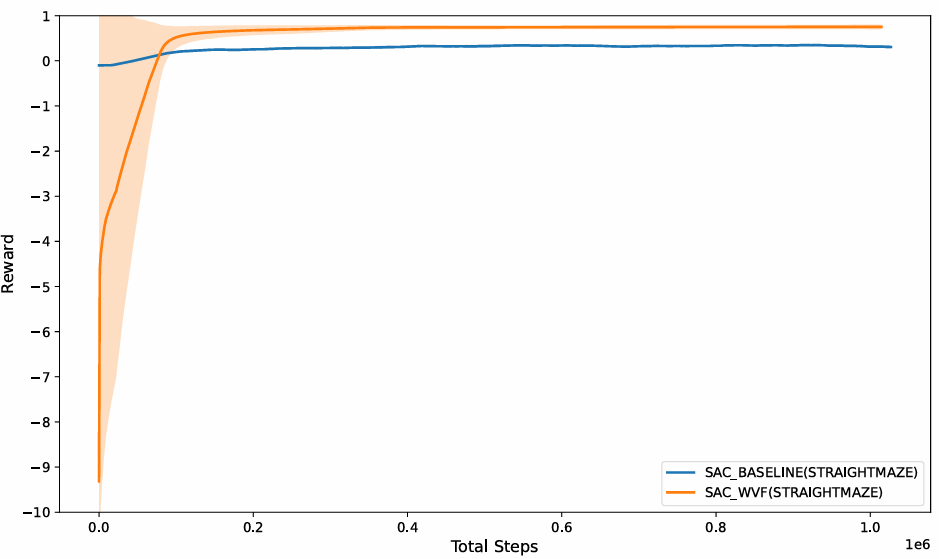
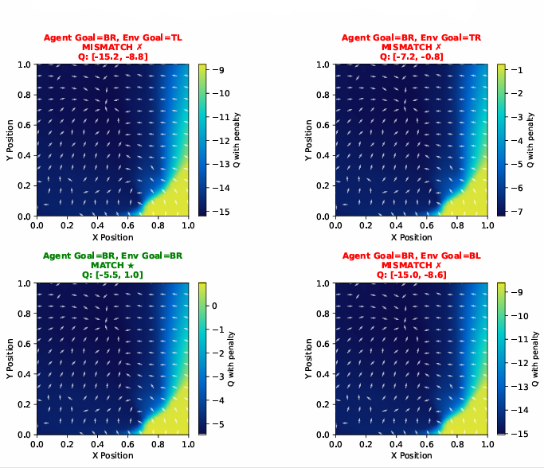
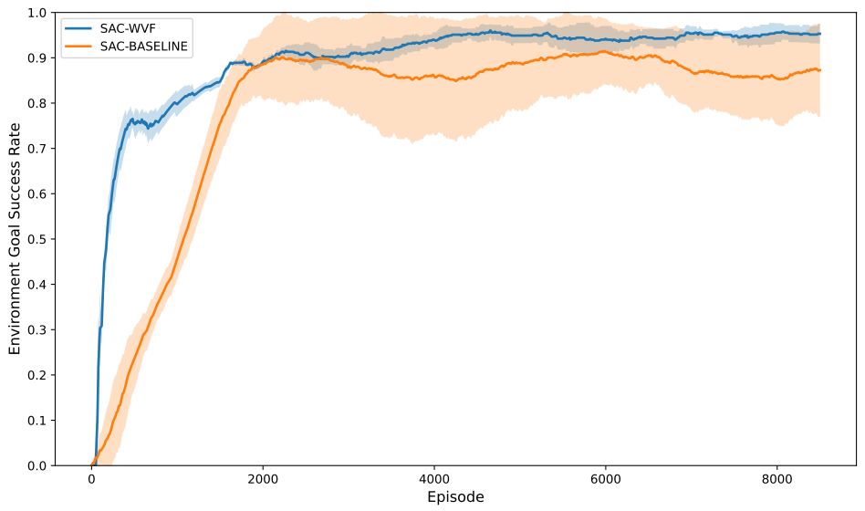

# WVF in Continuous Control: Goal-Conditioned Reinforcement Learning with Continuous WVF and Langevin Sampling

This repository implements a **GCRL Soft Actor-Critic (SAC)** framework enhanced with **World Value Function (WVF)** critics and **Langevin-based goal sampling**.  
It supports **Gymnasium Robotics** environments and custom wrappers that allow the agent to autonomously discover and refine internal goals.

---

## Requirements

### Python
- **Python 3.10 or 3.11**  
  *(Python 3.12 is not yet fully compatible with `mujoco` and `gymnasium-robotics`.)*

### Dependencies
| Package | Purpose | Recommended Version |
|----------|----------|----------------------|
| `torch` | Deep learning and policy/value networks | ≥ 2.0.0 |
| `gymnasium` | Reinforcement learning environments | ≥ 0.29.1 |
| `gymnasium-robotics` | Robotic and goal-conditioned tasks | ≥ 1.3.0 |
| `mujoco` | Physics simulator backend for robotics | ≥ 3.0.0 |
| `numpy` | Numerical operations | ≥ 1.24 |
| `tensorboard` | Logging and visualization | ≥ 2.12 |

### Optional (Recommended for Development)
| Package | Purpose |
|----------|----------|
| `matplotlib` | Plot learning curves and metrics |
| `pandas` | Analyze CSV logs |
| `tqdm` | Progress bars during training |
| `pytest` | Testing utilities |
| `wandb` or `mlflow` | Experiment tracking |
## Experiments & Visualization

To train the **GCRL-SAC WVF** on a gymnasiumrobotics environment, run: 
`python main.py`  
To train **GCRL-SAC BASELINE** on a gymnasiumrobotics environment, run: 
`python sac_baseline_HER/main.py`  
Training completes after a minimum of 3 seed trials for both the **GCRL-SAC BASELINE and GCRL-SAC WVF**, to obtain a plot of mastery and done action ratio during training for the STRAIGHTMAZE environment run: 

`python done_mastery_eval_maze.py`  
The ***mastery & done action*** plot like below will obtained: 
`python sac_baseline_v_wvf_peformance_training_maze.py`  

  

 

To obtain the **GCRL-SAC BASELINE and GCRL-SAC WVF** ***peformance*** during training plot, run: 
`python sac_baseline_v_wvf_peformance_training_maze.py`  
The peformance comparison plot like below will obtained: 

  

To obtain the **GCRL-SAC BASELINE and GCRL-SAC WVF** distance-to-goal plot run: 
`python goal_distance_vs_steps.py`  
The ***distance to goal*** for measure of sample efficiency during training curve comparison between **GCRL-SAC BASELINE and GCRL-SAC WVF** plot like below will obtained: 
The peformance comparison plot like below will obtained: 

  

To train the  GCRL-SAC WVF agent exclusively on four corners **TOP LEFT, TOP RIGHT, BOTTOM RIGHT, BOTTOM LEFT** in the STARIGHTMAZE environment run: 
`python 4_corners_sac_wvf_straightmaze/main.py`  
The heatmaps like below will be obtained during training as they are saved along with checkpoints at 20000 steps intervals: 

  

To obtain the  **GCRL-SAC BASELINE and GCRL-SAC WVF**  ***desired environment goal*** during training run: 
`desired_env_goal_success_eval/main.py`  
The plot like below will be obtained after enough training steps of approximately 1 million: 

  

 

The results for the plots in the report may be instantly obtained by running the following commands: 
**Training Peformance Evaluations**: 

`seed_3_eval/sac_baseline_v_wvf_peformance_training_maze.py`

`seed_3_eval/sac_baseline_v_wvf_peformance_training_reach.py`

**Done Action and Mastery Evaluations**: 

`seed_3_eval/done_mastery_eval_maze.py`

`seed_3_eval/done_mastery_eval_reach.py`

**Success At Desired Environment Goal Evaluation**: 
`seed_3_eval/desired_env_goal_success_eval.py`

**Sampling Efficiency Evaluation**: 
`seed_3_eval/goal_distance_vs_steps.py`
